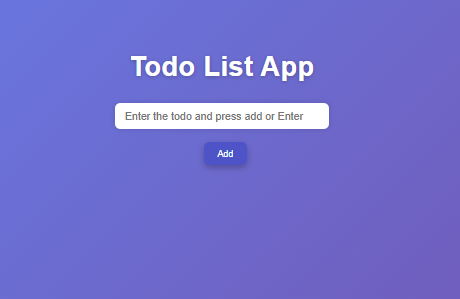

# 📝 Smart To-Do List

A clean, minimalist, and practical **To-Do List application** built using **HTML5, CSS3, and JavaScript**. Organize your daily goals efficiently with an intuitive UI designed for seamless task tracking.

---

## 🚀 Features

- **Dynamic Task Management:** Easily add new tasks and delete completed or unwanted items instantly.
- **Status Checkboxes:** Check off items when finished to visibly track your progress.
- **Empty Input Validation:** Prevents adding blank tasks with helpful user feedback alerts.
- **Modern Workspace Layout:** Centered, spacious task card layout with optimized focus effects on input fields.

---

## 🛠️ Tech Stack

- **HTML5:** Set up the task input container and listing structure.
- **CSS3:** Styled elements for checking items, custom scrollbars, and modern shadows.
- **JavaScript (ES6):** Dynamic DOM manipulation to add, toggle, and filter active tasks.

---

## 📸 Demo



---

## 📂 Project Structure

```text
├── index.html      # Task inputs and target lists
├── style.css       # Layout designs and checked-off styling
└── script.js       # DOM injection and list array controls
```

---

### 📝 Todo List Application

````markdown
## 🚀 How to Run Locally

### 1. Clone and Enter the Repository

```bash
git clone [https://github.com/amirsohail100/Todo-List-Application.git](https://github.com/amirsohail100/Todo-List-Application.git)
cd Todo-List-Application
```
````
